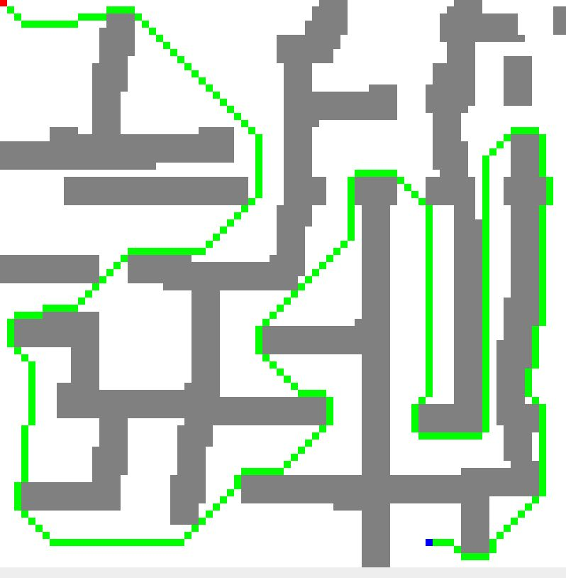
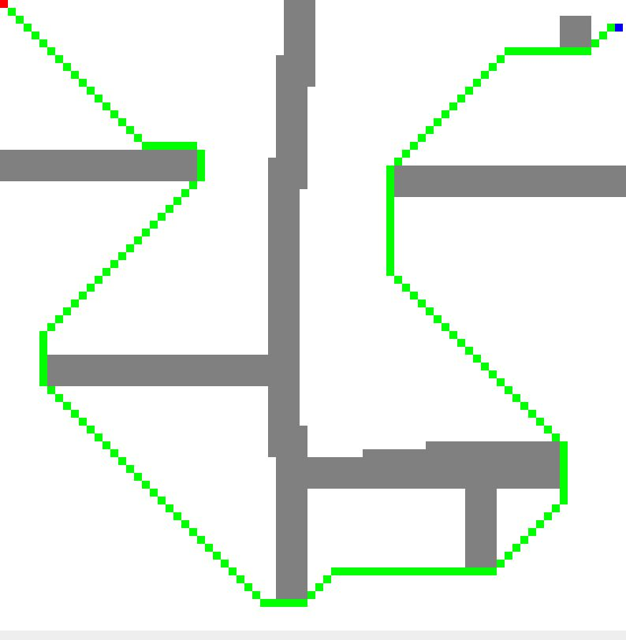
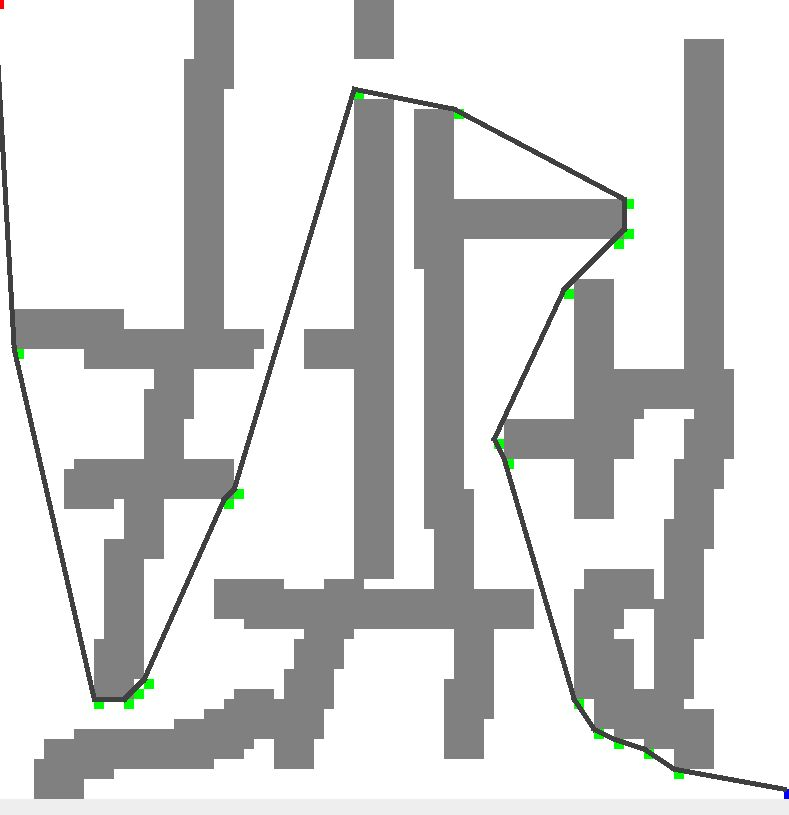

### PathPlanning

用Java Swing简单地实现以下几种基于搜索的路径规划算法：

- Dijkstra(无脑)
- AStar(引入启发式函数)
- JPS(只适用于网格地图)
- ThetaStar(任意角度的路径规划，更加平滑)

Dijkstra算法


A*算法



JPS算法



Theta*算法



### Usage

Main.java

```java
import pathplanning.*;

import java.util.List;

public class Main {
    public static void main(String[] args) {
        int[][] map = {
                {0, 0, 0, 0},
                {1, 0, 0, 1},
                {1, 0, 1, 1},
                {1, 0, 0, 0}
        };
        Grid grid = Util.loadByMapFile("res/map2.txt");
        // Grid grid = Util.loadByArray(map);

        AStar aStar = new AStar(14, 1, 14, 26, grid);
        List<Node> path = aStar.run();
        System.out.println(path);

        Util.printGird(grid, path);
    }
}
```

AStar类作为所有路径规划算法类的基类，因此可以扩展AStar类来添加其他功能。对于 Theta*算法，`run()`返回的是关键转折点，而非连续的点。
